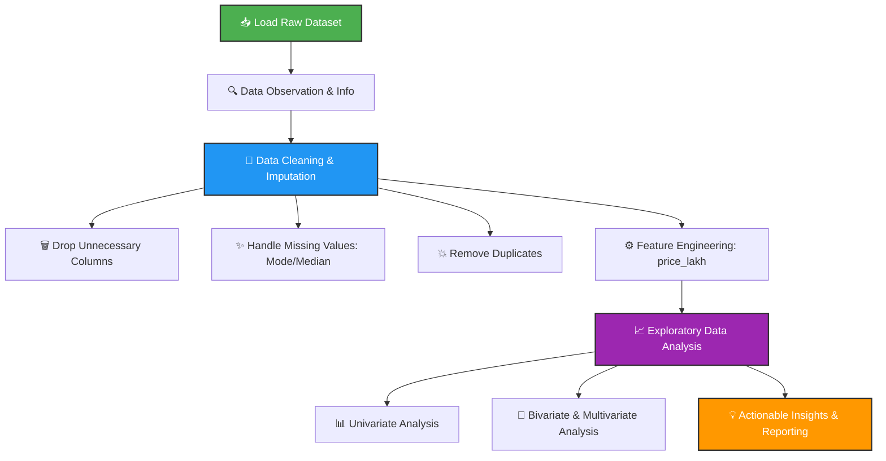

# 🚗 CarDekho Used Car Price - Exploratory Data Analysis (EDA)

[](https://www.python.org/)
[](https://pandas.pydata.org/)
[](https://jupyter.org/)
[](https://opensource.org/licenses/MIT)

An end-to-end **Exploratory Data Analysis (EDA)** project on the **CarDekho Dataset** to analyze and identify key factors that influence the selling price of used cars in the Indian market.

---

## 🎯 Project Objectives & Outcomes

*   **Objective:** Perform structured data preprocessing, cleaning, and visual analysis to decipher what drives the valuation of used vehicles.
*   **Expected Outcomes:** 
    *   💡 **For Buyers:** Make data-backed, informed, and fair purchasing decisions.
    *   🏷️ **For Sellers:** Price used vehicles competitively to maximize returns while ensuring faster sales.

---

## 📊 Exploratory Data Analysis Lifecycle

Here is the structured path followed in this project from raw, messy Kaggle data to high-value actionable insights:



---

## 📂 Project Structure

```bash
├── cardekho.ipynb               # 📓 Main Jupyter Notebook with code, plots & insights
├── CarDekho_Raw_Dataset.csv     # 📥 Raw dataset sourced from Kaggle
├── cardekho_Cleaned_dataset.csv # 🧼 Polished, cleaned, and preprocessed dataset
├── CarDekho_EDA_Final.pptx      # 📊 Final executive presentation
└── .gitignore                   # 🚫 Git ignoring rule configuration
```

---

## 🧼 Highlights of the Data Preprocessing Pipeline

1.  **Drop-list:** Removed index columns (`Unnamed: 0`) and other unhelpful identifiers to streamline analysis.
2.  **Missing Values Treatment:**
    *   **Categorical columns** (`seller_type`, `fuel_type`, `transmission_type`) -> Imputed using the **Mode** (most frequent class).
    *   **Numerical columns** (`vehicle_age`, `km_driven`, `mileage`, `engine`, `max_power`) -> Imputed using the **Median** to prevent outlier skewness.
    *   **Discrete elements** (`seats`) -> Filled using **Mode**.
3.  **Target Integrity:** Safely eliminated rows with missing values in `selling_price` (under 6% of the dataset) since target imputation introduces bias.
4.  **Feature Engineering:** Engineered a highly readable `price_lakh` column by converting raw pricing to Indian Rupees (Lakhs).

---

## 📈 Key Insights & Analytical Visualizations

Detailed findings extracted from the interactive **Plotly Dark-themed visualizations** in our Jupyter notebook:

### 🔵 1. Univariate Analysis (Individual Distributions)
*   **Car Selling Price:** The majority of used cars are concentrated in the **₹5–20 Lakh** bracket, showing a distinct right-skewed distribution. High-end luxury cars priced above **₹50 Lakh** form a thin tail of premium exceptions.
*   **Vehicle Age:** The used car market is dominated by relatively newer vehicles. Most cars in the dataset are between **0–10 years old**. There is a sharp decline in listings for cars older than **15 years**, reflecting standard vehicle retirement ages and depreciation-related scrappage trends in India.
*   **Fuel Type Distribution:** The used car market is overwhelmingly dominated by **Diesel** and **Petrol** cars. Newer green alternatives like **CNG** and **Electric** vehicles have very low representation, reflecting early-stage adoption curves.

### 🟡 2. Bivariate Analysis (Price Drivers)
*   **Vehicle Age vs. Price:** A strong negative relationship is observed. Price depreciates rapidly as the vehicle gets older.
*   **Fuel Type vs. Price:** Interestingly, **Electric vehicles** command the highest average selling price in the used market, followed by **Diesel** and **Petrol**, while **CNG** remains the most budget-friendly option.
*   **Engine Size vs. Price:** Engine capacity is a powerful proxy for price segmentation.
    *   *Small Engines (<1200cc):* Average price is around **₹8 Lakh**.
    *   *Medium Engines (1200cc - 1800cc):* Average price scales up.
    *   *Large Engines (>1800cc):* Command premium rates, averaging **₹20+ Lakh**.
*   **Usage (KM Driven) vs. Price:** Binned analysis shows an inverse relationship; as mileage (kilometers driven) increases, average selling price declines linearly. Usage and wear act as reliable predictors of depreciation.

### 🧡 3. Price Segmentation & Market Share
Based on pricing, the used car market was categorized into four segments:
*   **Budget Segment (Below ₹10 Lakh):** Heavily dominates the market, representing the high-volume core.
*   **Mid-range Segment (₹10 – ₹20 Lakh):** Represents value-seeking buyers looking for newer features.
*   **Premium Segment (₹20 – ₹40 Lakh):** Represents executives and entry-level luxury buyers.
*   **Luxury Segment (Above ₹40 Lakh):** A distinct high-margin niche comprising ultra-premium vehicles.

### 🏆 4. Brand Performance
*   **Volume Leaders:** **Maruti Suzuki** and **Hyundai** lead by a huge margin in terms of total listing counts, but have low-to-moderate average selling prices.
*   **Premium Brands:** **BMW**, **Mercedes-Benz**, and **Audi** have extremely low listing counts but average selling prices that dwarf the volume leaders, demonstrating a clear volume-vs-premium trade-off.

### 📝 Executive Summary of Findings

| # | Analytical Finding | Business / Buyer Impact |
|---|--------------------|-------------------------|
| **1** | Most cars are priced between ₹5–20 Lakh | The market is heavily centered around the budget/mid-range consumer. |
| **2** | `engine` and `max_power` are the strongest positive price predictors | Performance metrics dominate valuation. Larger engines translate to high luxury segments. |
| **3** | Electric cars lead average pricing, CNG is lowest | Green technology commands a premium; gas alternatives remain economical. |
| **4** | Price drops steadily with vehicle age and KM driven | Critical benchmark for depreciation calculation and resale timing. |
| **5** | Dealer-sold cars command significantly higher prices | Reflects premium valuation for certification and convenience. |
| **6** | Large engine cars average ₹20+ Lakh vs. ₹8 Lakh for small engines | Visualizes the clear separation of premium vs. commuter fleets. |
| **7** | Cleaned dataset achieved 100% data completeness | No residual missingness, ensuring robust inputs for ML models. |

---

## 🚀 How to Run locally

Follow these steps to run the Jupyter notebook on your local computer:

1. **Clone the repository:**
   ```bash
   git clone <your-repository-url>
   cd <repository-folder-name>
   ```

2. **Set up a Virtual Environment (Optional but Recommended):**
   ```bash
   python -m venv venv
   # Activate on Windows:
   venv\Scripts\activate
   # Activate on macOS/Linux:
   source venv/bin/activate
   ```

3. **Install Dependencies:**
   Ensure you have `pandas`, `numpy`, `matplotlib`, `seaborn`, `plotly`, and `jupyter` installed:
   ```bash
   pip install pandas numpy matplotlib seaborn plotly jupyter
   ```

4. **Launch the Notebook:**
   ```bash
   jupyter notebook cardekho.ipynb
   ```

---

## 🛡️ License

Distributed under the MIT License. See `LICENSE` for more information.

---

*Made with ❤️ by [Prathamesh Talele](https://github.com/prathamesh9164)*
