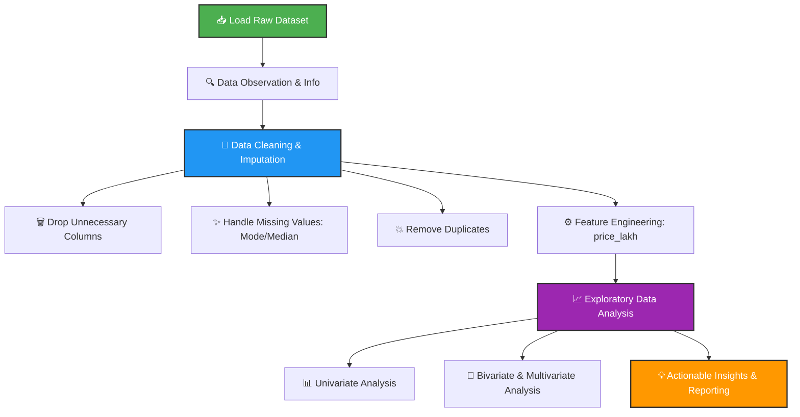

# 🚗 CarDekho Used Car Price - Exploratory Data Analysis (EDA)

[](https://www.python.org/)
[](https://pandas.pydata.org/)
[](https://jupyter.org/)
[](https://opensource.org/licenses/MIT)

An end-to-end **Exploratory Data Analysis (EDA)** project on the **CarDekho Dataset** to analyze and identify key factors that influence the selling price of used cars in the Indian market.

---

## 🎯 Project Objectives & Outcomes

*   **Objective:** Perform structured data preprocessing, cleaning, and visual analysis to decipher what drives the valuation of used vehicles.
*   **Expected Outcomes:** 
    *   💡 **For Buyers:** Make data-backed, informed, and fair purchasing decisions.
    *   🏷️ **For Sellers:** Price used vehicles competitively to maximize returns while ensuring faster sales.

---

## 📊 Exploratory Data Analysis Lifecycle

Here is the structured path followed in this project from raw, messy Kaggle data to high-value actionable insights:



---

## 📂 Project Structure

```bash
├── cardekho.ipynb               # 📓 Main Jupyter Notebook with code, plots & insights
├── CarDekho_Raw_Dataset.csv     # 📥 Raw dataset sourced from Kaggle
├── cardekho_Cleaned_dataset.csv # 🧼 Polished, cleaned, and preprocessed dataset
├── CarDekho_EDA_Final.pptx      # 📊 Final executive presentation
└── .gitignore                   # 🚫 Git ignoring rule configuration
```

---

## 🧼 Highlights of the Data Preprocessing Pipeline

1.  **Drop-list:** Removed index columns (`Unnamed: 0`) and other unhelpful identifiers to streamline analysis.
2.  **Missing Values Treatment:**
    *   **Categorical columns** (`seller_type`, `fuel_type`, `transmission_type`) -> Imputed using the **Mode** (most frequent class).
    *   **Numerical columns** (`vehicle_age`, `km_driven`, `mileage`, `engine`, `max_power`) -> Imputed using the **Median** to prevent outlier skewness.
    *   **Discrete elements** (`seats`) -> Filled using **Mode**.
3.  **Target Integrity:** Safely eliminated rows with missing values in `selling_price` (under 6% of the dataset) since target imputation introduces bias.
4.  **Feature Engineering:** Engineered a highly readable `price_lakh` column by converting raw pricing to Indian Rupees (Lakhs).

---

## 🚀 How to Run locally

Follow these steps to run the Jupyter notebook on your local computer:

1. **Clone the repository:**
   ```bash
   git clone <your-repository-url>
   cd <repository-folder-name>
   ```

2. **Set up a Virtual Environment (Optional but Recommended):**
   ```bash
   python -m venv venv
   # Activate on Windows:
   venv\Scripts\activate
   # Activate on macOS/Linux:
   source venv/bin/activate
   ```

3. **Install Dependencies:**
   Ensure you have `pandas`, `numpy`, `matplotlib`, `seaborn`, and `jupyter` installed:
   ```bash
   pip install pandas numpy matplotlib seaborn jupyter
   ```

4. **Launch the Notebook:**
   ```bash
   jupyter notebook cardekho.ipynb
   ```

---

## 🛡️ License

Distributed under the MIT License. See `LICENSE` for more information.

---

*Made with ❤️ by [Prathamesh Talele](https://github.com/prathamesh9164)*
